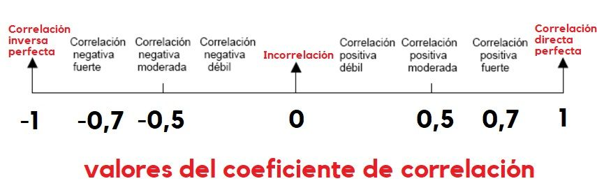

\centering 

\newpage

\tableofcontents

\newpage

```{r setup, include=FALSE}
knitr::opts_chunk$set(echo = TRUE)
```

```{r message=FALSE, warning=FALSE, include=FALSE}
library(readr)
library(tidyverse)
library(kableExtra)
library(magrittr)
library(ggExtra)
library(GGally)
library(janitor)
library(tidystats)
library(car)
library(faraway)
library(lmtest)
library(graphics)
# lectura de la base de datos:
stature <- read_csv("estaturas.csv")
```

# Objetivos:

Crear un modelo ajustado de R.L.M. por el cual se pueda predecir la estatura de un individuo (discrimiando por genero) sabiendo las estaturas de los padres (madre y padre) utilizando el software estadístico *R*.

## Objetivos específicos

-   Plantear el modelo de R.L.M.

-   Interpretar los parámetros del modelo.

-   Determinar si el efecto de las estaturas de los padres sobre la estatura del sujeto es significativo.

-   Interpretar nuestro $R^2$.

-   Validar los supuestos del modelo.

-   Aplicar la prueba de falta de ajuste.


# Antecedentes Relevantes

La población encuestada, pertenece a estudiantes de la Universidad Nacional de Colombia sede Medellín de diferentes carreras, es decir, la mayoria de los sujetos de la muestra son jovenes entre los 18 y los 25 años, además decidimos que solamente aquellos que tenian la posibilidad de saber las estaturas de sus padres entraban a nuestra base de datos, ya que el porceso sería más arduo si tomamos datos donde nos faltan llenar valores en las celdas correspondientes.


# Variables de respuesta:

En nuestro caso será la estatura del sujeto (Hombre o Mujer) para ajustar un modelo para predecir por medio de nuestras variables predictoras la esturura del sujeto.

# Variable de Control:

En este caso tendremos 3 varibles haciendo de este un modelo de R.L.M.

1. Estatura del Padre.
2. Estatura del Madre.
3. Genero del sujeto.

# Creación del Modelo

Nuestro modelo tendra la forma de:

$Y_i = \beta_0 + \beta_1X_{i1} + \beta_2X_{i2} + \beta_3X_{i3}+\varepsilon_i, \ i=1,...,30 \ \ donde \ \varepsilon_i \sim N(0,\sigma^2)$

Para llegar a lo anterior primero miraremos nuestra base de datos y como se comportan estas variables *(algunos datos...)*.

```{r echo=FALSE, message=FALSE, warning=FALSE}
kable(rbind(head(stature, n = 5),rep(".", ncol(stature)),
            rep(".", ncol(stature)),rep(".", ncol(stature)),
            tail(stature, n = 5)),digits = 30, align = "c")
```

Definimos nuestras variables:

- `est_sujeto`: Estatura en cm del sujeto encuestado.

- `genero`: Genero del sujeto encuestado.

- `exp_sujeto`: Fecha de expedición de la cedula del sujeto.

- `est_madre`: Estatura de la madre del sujeto en cm.

- `est_padre`: Estatura del padre del sujeto en cm.

- `ced_sujeto`: Ultimos cuatro dijitos de la cedula del sujeto encuestado.

- `ced_madre`: Ultimos cuatro dijitos de la cedula de la madre.

- `ced_padre`: Ultimos cuatro dijitos de la cedula del padre.

- `exp_madre`: Fecha de expedición de la cedula de la madre.

- `exp_padre`: Fecha de expedición de la cedula del padre.

# Análisis de correlación

Comenzamos representando los datos en una nube de puntos múltiple, donde vemos la relación entre cada par de variables.

```{r echo=FALSE, message=FALSE, warning=FALSE}
stature$genero %<>% as.factor()
stature$exp_sujeto %<>% as.Date(format="%d/%m/%Y")
stature$exp_padre %<>% as.Date(format="%d/%m/%Y")
stature$exp_madre %<>% as.Date(format="%d/%m/%Y")
stature$ced_madre %<>%  as.character()
stature %>% ggpairs(.,columns=c(1,2,4,5), aes(color=genero,alpha=0.5))
```


```{r message=FALSE, warning=FALSE, include=FALSE}
colnames(stature) <- c("est","genero","exp","est_ma","est_pa","ced",
                         "ced_ma","ced_pa","exp_pa","exp_ma")
```

Según la sigueinte tabla veremos que tan debil o fuerte son los datos respecto a otros:



como podemos apreciar nuestras 3 correlaciones entre cada variable predictora y nuestra $Y$ es una *Correlación Negativa débil* ya que ninguno supera $\pm 0.5$.

# Ajuste del modelo

```{r echo=FALSE, message=FALSE, warning=FALSE}
modelo.m <- lm(est ~ est_pa + est_ma + genero, data = stature)
summary(modelo.m)
```

El error típico residual es `11.2`, la $R^2=0.3025$, aunque para el modelo múltiple es mejor fijarnos en su valor ajustado $R_a^2=0.222$. Esto que significa que la recta de regresión explica el 22.22% de la variabilidad del modelo. Además, `F = 3.758` con una significación $p<0.05$, lo que nos dice que nuestro modelo de regresión resulta un poco mejor que el modelo básico.

# Comparación de modelos

Pretendemos seleccionar el “mejor” subconjunto de predictores por varias razones: 

1. Explicar los datos de la manera más simple. Debemos eliminar predictores redundantes.

2. Predictores innecesarios añade ruido a las estimaciones.

3. La causa de la multicolinealidad es tener demasiadas variables tratando de hacer el mismo trabajo. Eliminar el exceso de predictores ayuda a la interpretación del modelo.

4. Si vamos a utilizar el modelo para la predicción, podemos ahorrar tiempo y/o dinero al no medir predictores redundantes.

Puesto que tenemos dos variables explicativas disponemos de 6 modelos posibles:

$modelo \ 1: \ est \sim est_{ma}+est_{pa}+genero$

$modelo \ 2: \ est \sim est_{ma}+genero$

$modelo \ 3: \ est \sim est_{pa}+genero$

$modelo \ 4: \ est \sim est_{ma}$

$modelo \ 5: \ est \sim est_{pa}$

$modelo \ 6: \ est \sim genero$

Vamos a ajustar cada uno de los modelos

```{r echo=FALSE, message=FALSE, warning=FALSE}
modelo2 <- lm(est~est_ma+genero, data=stature)
modelo3 <- lm(est~est_pa+genero, data=stature)
modelo4 <- lm(est~est_ma, data=stature)
modelo5 <- lm(est~est_pa, data=stature)
modelo6 <- lm(est~genero, data=stature)

summary(modelo2)
summary(modelo3)
summary(modelo4)
summary(modelo5)
summary(modelo6)
```

Para evitar la elección subjetiva del mejor modelo, podemos comparar todos los modelos mediante una tabla ANOVA conjunta para cada par de modelos.

> Nota: Se escoje el de menor error estandar (RSS)

```{r echo=FALSE, message=FALSE, warning=FALSE}
anova(modelo2,modelo3)
anova(modelo2,modelo4)
anova(modelo2,modelo5)
anova(modelo2,modelo6)
print("Mejor modelo del 2 al 6 con menor RSS")
anova(modelo2,modelo.m)
```

Comparando ambas tablas anova deducimos que el modelo que mejor se ajusta a los datos es el `modelo2` pues reduce el error estándar.

# Selección del “mejor” modelo

Existen distintos métodos a la hora de construir un modelo complejo de regresión con varios predictores

* El **método jerárquico** en el que se seleccionan los predictores basándose en un trabajo anterior y el investigador decide en qué orden introducir las variables predictoras al modelo.

* El **método de entrada forzada** en el que todas las variables entran a la fuerza en el modelo simultáneamente.

* Los **métodos paso a paso** que se basan en un criterio matemático para decidir el orden en que los predictores entran en el modelo.

Nosotros vamos a utilizar en R los métodos paso a paso


## Resumen de las variables de interes

```{r echo=FALSE, message=FALSE, warning=FALSE}
# Eliminamos la variables que no nos interesan en el modelo:
df <- stature[, c(1,2,4,5)]
summary(df)
```

En todas las variables explicativas los valores de la media y la mediana son muy cercanos, lo cual es muy bueno.

## Correlación
```{r echo=FALSE, message=FALSE, warning=FALSE}
cor.test(df$est, df$est_ma)
cor.test(df$est, df$est_pa)
cor.test(df$est_pa, df$est_ma)
```

Como podemos ver nuestras variables estan correlacionada negativamente, además tenemos que no superan el umbral de $\pm 0.5$ lo que conlleva a que tenga una correlación debil.

Si miramos sus $p-value$ podemos encontrar que solamente para el caso de las madres se rechaza ña hipotesís $H_0$ donde se asume que la correlación entre este tipo de variables pude ser igual a cero, es decir, que de alguna forma los datos estan correlacionados negativamente entre la estatura del sujeto y de la madre.

Vamos a aplicar los tres métodos a nuestros modelos para cómo funciona cada uno de ellos

```{r echo=FALSE, message=FALSE, warning=FALSE}
df %>% ggplot(., aes(x=genero, y=est, color=genero))+
  geom_boxplot()+
  geom_jitter(width = 0.1)+
  theme_bw()+theme(legend.position = "none")+
  labs(x="Estatura del sujeto encuestado",
       y="Genero del sujeto encuestado",
       title = "Boxplot Genero vs Estatura")
```

El análisis gráfico y de correlación muestran una relación lineal significativa entre la variable `est` y `est_ma`. La variable genero parece influir de forma significativa en la estaura. Ambas variables pueden ser buenos predictores en un modelo lineal múltiple para la variable dependiente `est`.

Esto confirma que nos quedaremos con el `modelo2` por ende a este
trabajaremos los datos.

> Volvemos a refrescar un poco la memoria con el **modelo2**:

```{r echo=FALSE, message=FALSE, warning=FALSE}
summary(modelo2)$coefficients
```

se nota puede notar viendo el valor $Pr(|t|)$ que la variable genero es la unica que se rechaza, dentro de la hipotesís que el $\beta_i =0$, es decir, nuestr modelo solamente se complementaria de los datos de la estatura de la madre.

pero observando el $R^2 = 0.1402$ podemos ver que solamente el kodelo explica el 14.02% de la variabilidad observada en la estatura de los sujetos; nuestro modelo junto con el valor $p-value=0.04957\approx0.05$ nos demuestra que nuestros datos no son significativos.

# Elección de los predictores

En este caso, al solo haber dos predictores, a partir del summary del modelo se identifica que solo la variable `est_ma` es importante.

```{r echo=FALSE, message=FALSE, warning=FALSE}
summary(modelo2)
```

# Condiciones para la regresión múltiple lineal

## Relación lineal entre los predictores numéricos y la variable dependiente:

```{r echo=FALSE, message=FALSE, warning=FALSE}
df %>% ggplot(.,aes(x=est_ma, y=modelo2$residuals))+
  geom_point()+
  geom_smooth(color="firebrick")+
  geom_hline(yintercept = 0)+
  theme_bw()+
  labs(x="Estatura de las madres de los sujetos",
       y="Residuales")
```

Se satisface la condición de linealidad. Se aprecian posibles datos atípicos.

## Distribución normal de los residuos:

```{r echo=FALSE, message=FALSE, warning=FALSE}
myQQnorm <- function(modelo, student = F, ...){
  if(student){
    res <- rstandard(modelo)
    lab.plot <- "Normal Q-Q Plot of Studentized Residuals"
  } else {
    res <- residuals(modelo)
    lab.plot <- "Normal Q-Q Plot of Residuals"
  }
  shapiro <- shapiro.test(res)
  shapvalue <- ifelse(shapiro$p.value < 0.001, "P value < 0.001", paste("P value = ", round(shapiro$p.value, 4), sep = ""))
  shapstat <- paste("W = ", round(shapiro$statistic, 4), sep = "")
  q <- qqnorm(res, plot.it = FALSE)
  qqnorm(res, main = lab.plot, ...)
  qqline(res, lty = 2, col = 2)
  text(min(q$x, na.rm = TRUE), max(q$y, na.rm = TRUE)*0.95, pos = 4, 'Shapiro-Wilk Test', col = "blue", font = 2)
  text(min(q$x, na.rm = TRUE), max(q$y, na.rm = TRUE)*0.80, pos = 4, shapstat, col = "blue", font = 3)
  text(min(q$x, na.rm = TRUE), max(q$y, na.rm = TRUE)*0.65, pos = 4, shapvalue, col = "blue", font = 3)
}

modelo2 %>% myQQnorm()
```

apesar de los datos atipicos se observa que cumple con la normalidad de los residuos.

Nos surge una duda, *¿estos datos atípicos estarán influenciando nuestros datos de alguna manera?*

## Variabilidad constante de los residuos:

```{r}
ggplot(data = data.frame(predict_values = predict(modelo2),
                                residuos = residuals(modelo2)),
              aes(x = predict_values, y = residuos))+
         geom_point()+
         geom_smooth(color = "firebrick", se = FALSE)+
         geom_hline(yintercept = 0)+
         theme_bw()

bptest(modelo2)
```

Como podemos ver nuestros $\varepsilon_i$ no tienen un varianza constante, apra ello miraremos estos datos atípicos y si hay necesidad de transformar los datos o aplicar un modelo donde las varianzas no sean constantes.


> Nota:
No multicolinialidad:
Dado que solo hay un predictor cuantitativo no se puede dar colinialidad.

## Autocorrelación:

```{r}
dwt(modelo2,alternative = "two.sided")
```

No hay evidencia de autocorrelación

## Identificación de posibles valores atípicos o influyentes

```{r}
outlierTest(modelo2)
```

Tal como se apreció en el estudio de normalidad de los residuos, la observación 13 tiene un residuo estandarizado >2 (más de 2 veces la desviación estándar de los residuos) por lo que se considera un dato atípico. El siguiente paso es determinar si es influyente.

```{r}
summary(influence.measures(modelo2))
influencePlot(modelo2)
```

El análisis muestran varias observaciones influyentes aunque ninguna excede la distancia de Cook > 1, pero como lo vimos antes, el dato en nuestra modelo tiene influencia si $Cook > \frac{4}{n}$, donde $n=30$, es decir, $Cook > 0.1333$; nuestros datos influenciadores y que superan, pero al no superar las distnacias del HAT, en fin. no hay datos atípicos en los datos, porque que se llega a la conclusión que este modelo no sirve para predecir o hacer inferencia sobre los datos de la madre y su hijo.

# Apendice:

## listas de Figuras:

1. Correlation plot.

2. Residuales vs Est_Madre.

3. QQnorm norm Residuales.

4. Predict vs Residuos

5. Infuence plot.

## Codigo:

```
## ----message=FALSE, warning=FALSE, include=FALSE--------------------------
library(readr)
library(tidyverse)
library(kableExtra)
library(magrittr)
library(ggExtra)
library(GGally)
library(janitor)
library(tidystats)
library(car)
library(faraway)
library(lmtest)
library(graphics)
# lectura de la base de datos:
stature <- read_csv("estaturas.csv")


## ----echo=FALSE, message=FALSE, warning=FALSE-----------------------------
kable(rbind(head(stature, n = 5),rep(".", ncol(stature)),
            rep(".", ncol(stature)),rep(".", ncol(stature)),
            tail(stature, n = 5)),digits = 30, align = "c")


## ----echo=FALSE, message=FALSE, warning=FALSE-----------------------------
stature$genero %<>% as.factor()
stature$exp_sujeto %<>% as.Date(format="%d/%m/%Y")
stature$exp_padre %<>% as.Date(format="%d/%m/%Y")
stature$exp_madre %<>% as.Date(format="%d/%m/%Y")
stature$ced_madre %<>%  as.character()
stature %>% ggpairs(.,columns=c(1,2,4,5), aes(color=genero,alpha=0.5))


## ----message=FALSE, warning=FALSE, include=FALSE--------------------------
colnames(stature) <- c("est","genero","exp","est_ma","est_pa","ced",
                         "ced_ma","ced_pa","exp_pa","exp_ma")


## ----echo=FALSE, message=FALSE, warning=FALSE-----------------------------
modelo.m <- lm(est ~ est_pa + est_ma + genero, data = stature)
summary(modelo.m)


## ----echo=FALSE, message=FALSE, warning=FALSE-----------------------------
modelo2 <- lm(est~est_ma+genero, data=stature)
modelo3 <- lm(est~est_pa+genero, data=stature)
modelo4 <- lm(est~est_ma, data=stature)
modelo5 <- lm(est~est_pa, data=stature)
modelo6 <- lm(est~genero, data=stature)

summary(modelo2)
summary(modelo3)
summary(modelo4)
summary(modelo5)
summary(modelo6)


## ----echo=FALSE, message=FALSE, warning=FALSE-----------------------------
anova(modelo2,modelo3)
anova(modelo2,modelo4)
anova(modelo2,modelo5)
anova(modelo2,modelo6)
print("Mejor modelo del 2 al 6 con menor RSS")
anova(modelo2,modelo.m)


## ----echo=FALSE, message=FALSE, warning=FALSE-----------------------------
# Eliminamos la variables que no nos interesan en el modelo:
df <- stature[, c(1,2,4,5)]
summary(df)


## ----echo=FALSE, message=FALSE, warning=FALSE-----------------------------
cor.test(df$est, df$est_ma)
cor.test(df$est, df$est_pa)
cor.test(df$est_pa, df$est_ma)


## ----echo=FALSE, message=FALSE, warning=FALSE-----------------------------
df %>% ggplot(., aes(x=genero, y=est, color=genero))+
  geom_boxplot()+
  geom_jitter(width = 0.1)+
  theme_bw()+theme(legend.position = "none")+
  labs(x="Estatura del sujeto encuestado",
       y="Genero del sujeto encuestado",
       title = "Boxplot Genero vs Estatura")


## ----echo=FALSE, message=FALSE, warning=FALSE-----------------------------
summary(modelo2)$coefficients


## ----echo=FALSE, message=FALSE, warning=FALSE-----------------------------
summary(modelo2)


## ----echo=FALSE, message=FALSE, warning=FALSE-----------------------------
df %>% ggplot(.,aes(x=est_ma, y=modelo2$residuals))+
  geom_point()+
  geom_smooth(color="firebrick")+
  geom_hline(yintercept = 0)+
  theme_bw()+
  labs(x="Estatura de las madres de los sujetos",
       y="Residuales")


## ----echo=FALSE, message=FALSE, warning=FALSE-----------------------------
myQQnorm <- function(modelo, student = F, ...){
  if(student){
    res <- rstandard(modelo)
    lab.plot <- "Normal Q-Q Plot of Studentized Residuals"
  } else {
    res <- residuals(modelo)
    lab.plot <- "Normal Q-Q Plot of Residuals"
  }
  shapiro <- shapiro.test(res)
  shapvalue <- ifelse(shapiro$p.value < 0.001, "P value < 0.001", paste("P value = ", round(shapiro$p.value, 4), sep = ""))
  shapstat <- paste("W = ", round(shapiro$statistic, 4), sep = "")
  q <- qqnorm(res, plot.it = FALSE)
  qqnorm(res, main = lab.plot, ...)
  qqline(res, lty = 2, col = 2)
  text(min(q$x, na.rm = TRUE), max(q$y, na.rm = TRUE)*0.95, pos = 4, 'Shapiro-Wilk Test', col = "blue", font = 2)
  text(min(q$x, na.rm = TRUE), max(q$y, na.rm = TRUE)*0.80, pos = 4, shapstat, col = "blue", font = 3)
  text(min(q$x, na.rm = TRUE), max(q$y, na.rm = TRUE)*0.65, pos = 4, shapvalue, col = "blue", font = 3)
}

modelo2 %>% myQQnorm()


## -------------------------------------------------------------------------
ggplot(data = data.frame(predict_values = predict(modelo2),
                                residuos = residuals(modelo2)),
              aes(x = predict_values, y = residuos))+
         geom_point()+
         geom_smooth(color = "firebrick", se = FALSE)+
         geom_hline(yintercept = 0)+
         theme_bw()

bptest(modelo2)


## -------------------------------------------------------------------------
dwt(modelo2,alternative = "two.sided")


## -------------------------------------------------------------------------
outlierTest(modelo2)


## -------------------------------------------------------------------------
summary(influence.measures(modelo2))
influencePlot(modelo2)

```

# Referencias:

**[1]** Coleman, D. E., & Montgomery, D. C. (1993). A Systematic Approach to Planning for a Designed Industrial Experiment. Technometrics, 35(1), 1--12. <https://doi.org/10.2307/1269280>

**[2]** The jamovi project (2021). jamovi. (Version 2.2) [Computer Software]. Retrieved from <https://www.jamovi.org>.

**[3]** R Core Team (2021). R: A Language and environment for statistical computing. (Version 4.0) [Computer software]. Retrieved from <https://cran.r-project.org>. (R packages retrieved from MRAN snapshot 2021-04-01).

**[4]** Fox, J., & Weisberg, S. (2020). car: Companion to Applied Regression. [R package]. Retrieved from <https://cran.r-project.org/package=car>.

**[5]** Ali S. Hadi, S. C. &. (2006). Linear models with r (4th edition.). John Wiley & Sons. Retrieved from <http://samples.sainsburysebooks.co.uk/9780470055458_sample_381725.pdf>

**[6]** Ferrari, D., & Head, T. (2010). Regression in r. part i: Simple linear regression. UCLA Department of Statistics Statistical Consulting Center. Retrieved October 13, 2014, from <http://scc.stat.ucla.edu/page_attachments/0000/0139/reg_1.pdf>

**[7]** Field, A., Miles, J., & Field, Z. (2012). Discovering statistics using r (1st edition.). Sage Publications Ltd.

**[8]** J.Faraway, J. (2009). Linear models with r (1st edition.). Taylor & Francis e-Library. Retrieved from <http://home.ufam.edu.br/jcardoso/PPGMAT537/Linear%20Models%20with%20R.pdf>

**[9]** Kabacoff, R. (2014). Creating a figure arrangement with fine control. Retrieved October 13, 2014, from <http://www.statmethods.net/advgraphs/layout.html>

**[10]** Pérez, J. L. (2014). La estadística: Una orqueta hecha instrumento. Retrieved October 13, 2014, from <http://estadisticaorquestainstrumento.wordpress.com/>

**[11]** Sánchez, J. G. P. (2011). Regresión lineal simple. Universidad Politécnica de Madrid. Retrieved October 13, 2014, from <http://ocw.upm.es/estadistica-e-investigacion-operativa/introduccion-a-la-estadistica-basica-el-diseno-de-experimentos-y-la-regresion-lineal/contenidos/Material-de-clase/Regresion.pdf>

**[12]** (SCG), S. S. C. G. (2013). Multiple linear regression (r). San Diego State University. Retrieved October 13, 2014, from <http://scg.sdsu.edu/mlr-r/>

**[13]** SPSS. (2007). Análisis de regresión lineal: El procedimiento regresión lineal. IBM SPSS Statistics. Retrieved October 13, 2014, from <http://pendientedemigracion.ucm.es/info/socivmyt/paginas/D_departamento/materiales/analisis_datosyMultivariable/18reglin_SPSS.pdf>
