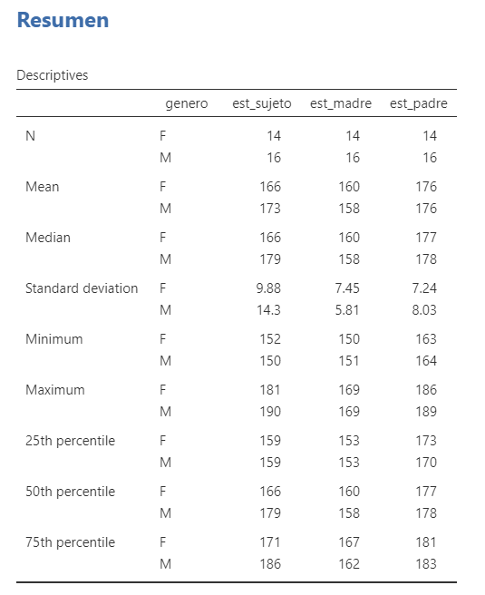

\centering 

\newpage

\tableofcontents

\newpage

```{r setup, include=FALSE}
knitr::opts_chunk$set(echo = TRUE)
```

```{r message=FALSE, warning=FALSE, include=FALSE}
library(readr)
library(tidyverse)
library(kableExtra)
library(magrittr)
library(ggExtra)
library(GGally)
estaturas <- read_csv("estaturas.csv")
```

# Objetivos:

Crear un modelo ajustado de R.L.M. por el cual se pueda predecir la estatura de un individuo (discrimiando por genero) sabiendo las estaturas de los padres (madre y padre) utilizando el software estadístico *R*.

## Objetivos Especificos

## Objetivos específicos

-   Plantear el modelo de R.L.M.

-   Interpretar los parámetros del modelo.

-   Determinar si el efecto de las estaturas de los padres sobre la estatura del sujeto es significativo.

-   Interpretar nuestro $R^2$.

-   Validar los supuestos del modelo.

-   Aplicar la prueba de falta de ajuste.


# Antecedentes Relevantes

La población encuestada, pertenece a estudiantes de la Universidad Nacional de Colombia sede Medellín de diferentes carreras, es decir, la mayoria de los sujetos de la muestra son jovenes entre los 18 y los 25 años, además decidimos que solamente aquellos que tenian la posibilidad de saber las estaturas de sus padres entraban a nuestra base de datos, ya que el porceso sería más arduo si tomamos datos donde nos faltan llenar valores en las celdas correspondientes.


# Variables de respuesta:

En nuestro caso será la estatura del sujeto (Hombre o Mujer) para ajustar un modelo para predecir por medio de nuestras variables predictoras la esturura del sujeto.

# Variable de Control:

En este caso tendremos 3 varibles haciendo de este un modelo de R.L.M.

1. Estatura del Padre.
2. Estatura del Madre.
3. Genero del sujeto. 

# Creación del Modelo

Nuestro modelo tendra la forma de:

$Y_i = \beta_0 + \beta_1X_{i1} + \beta_2X_{i2} + \beta_3X_{i3}+\varepsilon_i, \ i=1,...,30 \ \ donde \ \varepsilon_i \sim N(0,\sigma^2)$

Para llegar a lo anterior primero miraremos nuestra base de datos y como se comportan estas variables *(algunos datos...)*.

```{r echo=FALSE, message=FALSE, warning=FALSE}
kable(rbind(head(estaturas, n = 5),
            rep(".", ncol(estaturas)), rep(".", ncol(estaturas)),
            rep(".", ncol(estaturas)),
            tail(estaturas, n = 5)),digits = 30, align = "c")
```


Definimos nuestras variables:

- `est_sujeto`: Estatura en cm del sujeto encuestado.

- `genero`: Genero del sujeto encuestado.

- `exp_sujeto`: Fecha de expedición de la cedula del sujeto.

- `est_madre`: Estatura de la madre del sujeto en cm.

- `est_padre`: Estatura del padre del sujeto en cm.

- `ced_sujeto`: Ultimos cuatro dijitos de la cedula del sujeto encuestado.

- `ced_madre`: Ultimos cuatro dijitos de la cedula de la madre.

- `ced_padre`: Ultimos cuatro dijitos de la cedula del padre.

- `exp_madre`: Fecha de expedición de la cedula de la madre.

- `exp_padre`: Fecha de expedición de la cedula del padre.


```{r echo=FALSE, message=FALSE, warning=FALSE}
estaturas$genero %<>% as.factor()
estaturas$exp_sujeto %<>% as.Date(.,tryFormats = c("%d/%m/%Y"))
estaturas$exp_padre %<>% as.Date(.,tryFormats = c("%d/%m/%Y"))
estaturas$exp_madre %<>% as.Date(.,tryFormats = c("%d/%m/%Y"))
estaturas$ced_madre %<>% as.character()
```

## Resumen de los datos:

Hacemos un resumen de los datos para mirar de primera mano nuestros valores estadísticos comunes ($\mu$, $\sigma$, mediana, máximo y mínimo valor)



Ahora para ser un poco más minuciosos haremos un *"boxplot"* e *histogramas* de los datos para observar como se comportan nuestras variables de control y respuesta.


```{r echo=FALSE, message=FALSE, warning=FALSE}
estaturas %>% ggplot(aes(x=est_sujeto, fill= genero))+
  geom_histogram(alpha=0.7, bins=6, color="black")+
  facet_grid(~genero)+
  theme(legend.position = "none")+
  labs(x="Estatura del sujeto en cm", y="Frecuencia",
       title = "Histograma de las estaturas del sujeto facetado por genero")
```

Podemos ver que los hombres sus estaturas varian mucho desde los $150 cm$ superando los $190cm$, esto en contra parte con las mujeres que se encuentran mejr agrupadas tenienedo tendencias más bajas que los hombres.

```{r echo=FALSE, message=FALSE, warning=FALSE}
estaturas %>% ggplot(aes(y=est_sujeto, x=genero, fill=genero))+
  stat_boxplot(geom = "errorbar", width = 0.5)+
  geom_boxplot(outlier.colour = "transparent") +
  geom_jitter(colour = "black", width = 0.1, height = 0)+
  xlab("Genero") + 
  ylab("Estatura") + 
  labs(fill = "Genero") + 
  labs(title = "Boxplot Estatura sujeto") + 
  theme_light()+theme(legend.position = "none")
```

Como podemos ver los datos de los hombres tienen mayores rangos englosando a las mujeres aun en sus bigotes superiores.

ahora observaremos como se distribuyen las estaturas de padre y madre:

```{r}
estaturas %>%  ggplot()+
  geom_density(aes(x=est_padre, fill="blue"), alpha=0.5)+
  geom_density(aes(x=est_madre,fill="red"), alpha=0.5)+
  theme_light()+
  labs(x="Estaturas en cm", y="Density",
       title = "Distribución de la estutura del padre y la madre",
       fill="Estaturas")+
  scale_fill_hue(labels = c("Padre", "Madre"))
```


